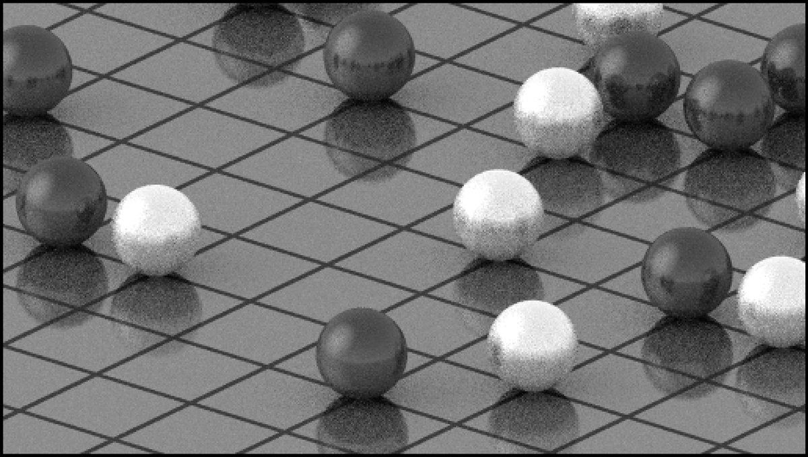

# ColorWeaver
Utilities for dealing with colors in libGDX, especially palettes

## Credits

For the images in samples/ , 

,
, ,
 are faithful reproductions of public-domain works of
art; they were all obtained from Wikipedia.

 is a remastered version of the public-domain Mona Lisa by Leonardo da Vinci.
[Its source is on Wikimedia Commons, here](https://commons.wikimedia.org/wiki/File:Mona_Lisa_Digitally_Restored.tif) .

 is a public-domain image of a red-eyed tree frog,
[taken by Carey James Balboa](https://commons.wikimedia.org/wiki/File:Red_eyed_tree_frog_edit2.jpg) .

 is a screenshot of the video game Chrono Cross, originally used in
[Joel Yliluoma's dithering article](https://bisqwit.iki.fi/story/howto/dither/jy/).

 was also used in the article linked above.

 was also used as an example in a dithering article,
but I can't remember where it was. I think it was about error-diffusion dither...

 is from https://commons.wikimedia.org/wiki/File:Replica_of_the_Koh-i-Noor_(cropped).jpg .

 is a snippet of a texture atlas made from some [wargame pixel art I previously released into the public domain](https://opengameart.org/content/pixvoxel-revised-isometric-wargame-sprites).
, , ,
, and  are all pictures I took of my pets. They
can be considered public domain.

, , ,
and  are all pictures Shelby Lynn took of her pets; I have permission to use them here.

 and  are lossy renders of a game board by
[Loren Schmidt](https://twitter.com/lorenschmidt/status/1703462926726640124); they're used here to compare dither
algorithms with what Schmidt is working on, but I'll take them down if she requests.